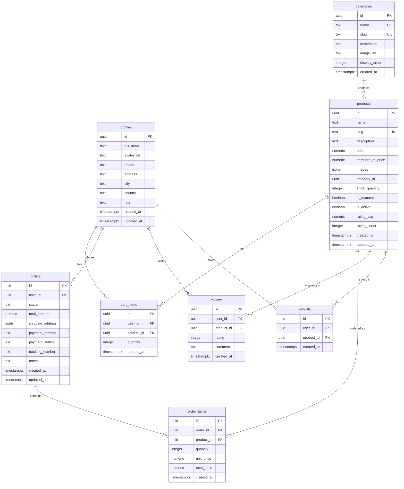

<div align="center">

# 🛒 NexShop

### Modern Full-Stack E-Commerce Platform

A production-ready e-commerce platform built with **React 18**, **TypeScript**, **Supabase**, and **Tailwind CSS** — featuring a complete customer storefront and admin dashboard.

[](https://react.dev/)
[](https://www.typescriptlang.org/)
[](https://supabase.com/)
[](https://tailwindcss.com/)
[](https://vitejs.dev/)
[](./LICENSE)

[Features](#-features) · [Tech Stack](#-tech-stack) · [Getting Started](#-getting-started) · [Architecture](#-architecture) · [Database Schema](#-database-schema) · [Deployment](#-deployment)

</div>

---

## 📖 Overview

**NexShop** is a comprehensive, full-stack e-commerce platform designed to deliver a seamless online shopping experience. Built with a modern tech stack and production-grade architecture, it features everything from product browsing and cart management to a complete admin dashboard for store operations.

The platform demonstrates advanced frontend patterns including lazy-loaded routes, context-based state management, real-time database interaction via Supabase, responsive design, scroll-triggered animations, and Row Level Security (RLS) for data protection.

---

## ✨ Features

### 🛍️ Customer Storefront

| Feature | Description |
|---|---|
| **Product Catalog** | Browse products with category filtering, search, sorting, and price range slider |
| **Product Detail** | Image gallery, star ratings, reviews, stock status, related products |
| **Shopping Cart** | Add/remove items, quantity controls, real-time price calculation, free shipping threshold |
| **Multi-Step Checkout** | Shipping → Payment → Review workflow with address form and order summary |
| **User Authentication** | Email/password sign-up and sign-in with Supabase Auth |
| **User Profile** | View and update personal info (name, phone, address, city, country) |
| **Order History** | Track past orders with status badges (Pending → Processing → Shipped → Delivered) |
| **Wishlist** | Save/unsave favorite products with persistent storage |
| **Product Reviews** | Rate products (1–5 stars) and leave comments; one review per product per user |

### 🔧 Admin Dashboard

| Feature | Description |
|---|---|
| **Dashboard Overview** | Revenue chart (7-day area chart), orders-by-status pie chart, top selling products, KPI cards with month-over-month trends, recent activity feed, low stock alerts |
| **Product Management** | Full CRUD with stats bar, category/status filters, bulk select & delete, server-side pagination, image previews, star ratings, search |
| **Order Management** | Status & payment filters, date range picker, search by ID/customer, order timeline progress bar, inline tracking number edit, CSV export, pagination |
| **Category Management** | Grid/list toggle view, product count per category, image previews, display order reorder controls, search |
| **Customer Directory** | Detail modal with order history & total spent, role filter, sort options, CSV export, server-side pagination |
| **Activity Log** | Unified timeline of orders, registrations, and reviews with type filters, relative timestamps, 24h stats |
| **Settings** | Store info, notification preferences, display settings (all persisted to localStorage), danger zone with reset |

### ⚡ Technical Highlights

| Feature | Description |
|---|---|
| **Code Splitting** | Lazy-loaded routes with `React.lazy()` and `Suspense` for fast initial load |
| **Error Boundary** | Graceful error recovery with user-friendly fallback UI |
| **SEO Optimized** | Dynamic page titles, meta tags, Open Graph tags, and `robots.txt` |
| **Type Safety** | End-to-end TypeScript with strict type definitions for all models |
| **Row Level Security** | Supabase RLS policies ensure users only access their own data |
| **Responsive Design** | Mobile-first layout with adaptive navigation and grid systems |
| **Custom Animations** | Scroll-triggered animations, staggered transitions, and micro-interactions |
| **Custom Hooks** | Reusable hooks for products, categories, reviews, debounce, and scroll animations |
| **Toast Notifications** | Context-driven toast system with success/error/info variants |
| **Auth Guards** | Protected routes for authenticated users and admin-only sections |
| **Admin Navigation** | Admin link auto-appears in navbar for admin-role users; context-aware CTA on homepage |

---

## 🛠 Tech Stack

<table>
  <tr>
    <td align="center" width="96">
      <br>
      <strong>React 18</strong><br>
      <sub>UI Library</sub>
    </td>
    <td align="center" width="96">
      <br>
      <strong>TypeScript</strong><br>
      <sub>Language</sub>
    </td>
    <td align="center" width="96">
      <br>
      <strong>Supabase</strong><br>
      <sub>Backend / DB</sub>
    </td>
    <td align="center" width="96">
      <br>
      <strong>Tailwind CSS</strong><br>
      <sub>Styling</sub>
    </td>
    <td align="center" width="96">
      <br>
      <strong>Vite 5</strong><br>
      <sub>Build Tool</sub>
    </td>
  </tr>
</table>

| Category | Technologies |
|---|---|
| **Frontend** | React 18, React Router 7, Recharts 2, Lucide React Icons |
| **Language** | TypeScript 5.5 (strict) |
| **Styling** | Tailwind CSS 3.4, Custom Design Tokens (brand/surface/accent), CSS Animations |
| **Backend** | Supabase (PostgreSQL, Auth, Row Level Security, Database Triggers) |
| **Build** | Vite 5, PostCSS, Autoprefixer |
| **Code Quality** | ESLint 9, TypeScript ESLint, React Hooks Plugin |

---

## 🚀 Getting Started

### Prerequisites

- **Node.js** ≥ 18.0.0
- **npm** ≥ 9.0.0
- **Docker Desktop** — required for local Supabase ([download](https://www.docker.com/products/docker-desktop))

### Option A — Quick Start (Windows)

```batch
setup.bat        REM One-time: installs deps, starts Docker, boots local Supabase, creates .env
run.bat          REM Daily: starts Supabase + Vite dev server
```

### Option B — Manual Setup

#### 1. Clone the Repository

```bash
git clone https://github.com/AbdelhamidKhald/fullstack-ecommerce-platform.git
cd fullstack-ecommerce-platform
```

#### 2. Install Dependencies

```bash
npm install
```

#### 3. Start Local Supabase

```bash
npx supabase start     # Pulls Docker images and starts all services
```

All 7 migrations are applied automatically:

| # | Migration | Description |
|---|---|---|
| 1 | `20260206193406_create_profiles_table.sql` | User profiles with auto-creation trigger |
| 2 | `20260206193543_create_categories_table.sql` | Product categories with RLS |
| 3 | `20260206193804_create_products_table.sql` | Products with rating aggregation trigger |
| 4 | `20260206193831_create_cart_orders_reviews_wishlists.sql` | Cart, orders, reviews, wishlists with RLS |
| 5 | `20260206193922_seed_products.sql` | Sample products and categories |
| 6 | `20260207210000_fix_rls_recursion.sql` | `is_admin()` SECURITY DEFINER function |
| 7 | `20260207230000_add_profile_fk_for_joins.sql` | FK links for PostgREST profile joins |

#### 4. Configure Environment Variables

```bash
cp .env.example .env
```

Get your local credentials and paste them into `.env`:

```bash
npx supabase status    # Shows API URL and anon key
```

```env
VITE_SUPABASE_URL=http://127.0.0.1:54321
VITE_SUPABASE_ANON_KEY=<anon-key-from-status>
```

> **Cloud Supabase**: You can also use a hosted Supabase project — create one at [supabase.com](https://supabase.com/), run the migration files in the SQL Editor, and use the cloud URL/key instead.

#### 5. Start the Development Server

```bash
npm run dev
```

The app will be available at **http://localhost:5173**

#### 6. Create an Admin User (Optional)

1. Register a new account through the app
2. Open Supabase Studio at **http://127.0.0.1:54323** → Table Editor → `profiles`
3. Update the user's `role` to `admin`
4. Refresh the app — an **Admin** link will appear in the top navigation bar

---

## 📜 Available Scripts

| Command | Description |
|---|---|
| `npm run dev` | Start development server with HMR |
| `npm run build` | Create optimized production build |
| `npm run preview` | Preview production build locally |
| `npm run lint` | Run ESLint across all TypeScript files |
| `npm run typecheck` | Run TypeScript compiler in check mode |
| `setup.bat` | **(Windows)** One-time full project setup — deps, Docker, Supabase, .env |
| `run.bat` | **(Windows)** Start Supabase + Vite dev server |
| `npx supabase start` | Start local Supabase via Docker |
| `npx supabase stop` | Stop local Supabase containers |
| `npx supabase db reset` | Reset database and re-run all migrations |

---

## 🏗 Architecture

### Project Structure

```
nexshop/
├── public/                    # Static assets
│   ├── favicon.svg            # Brand favicon
│   └── robots.txt             # SEO robots file
├── src/
│   ├── components/
│   │   ├── layout/            # App shell components
│   │   │   ├── AuthGuard.tsx   # Route protection (Auth + Admin)
│   │   │   ├── Footer.tsx      # Site footer with contact & project links
│   │   │   ├── Layout.tsx      # Main layout wrapper
│   │   │   └── Navbar.tsx      # Responsive nav with admin link for admin users
│   │   ├── product/           # Product-specific components
│   │   │   ├── ProductCard.tsx # Product card with wishlist/cart actions
│   │   │   └── ProductGrid.tsx # Responsive product grid
│   │   └── ui/                # Reusable UI primitives
│   │       ├── AnimatedSection.tsx  # Scroll-triggered animations
│   │       ├── EmptyState.tsx       # Empty state placeholder
│   │       ├── ErrorBoundary.tsx    # Error boundary with recovery
│   │       ├── Modal.tsx            # Accessible modal dialog
│   │       ├── Skeleton.tsx         # Loading skeleton placeholders
│   │       ├── Spinner.tsx          # Loading spinners
│   │       ├── StarRating.tsx       # Interactive star rating
│   │       └── ToastContainer.tsx   # Toast notification display
│   ├── context/               # React Context providers
│   │   ├── AuthContext.tsx     # Authentication state & methods
│   │   ├── CartContext.tsx     # Shopping cart state & methods
│   │   └── ToastContext.tsx    # Toast notification system
│   ├── hooks/                 # Custom React hooks
│   │   ├── useAnimateOnScroll.ts   # IntersectionObserver animation
│   │   ├── useCategories.ts        # Category data fetching
│   │   ├── useDebounce.ts          # Input debouncing
│   │   ├── useDocumentTitle.ts     # Dynamic page titles (SEO)
│   │   ├── useProducts.ts          # Product listing & detail
│   │   └── useReviews.ts           # Review CRUD operations
│   ├── lib/                   # Utilities & configuration
│   │   ├── constants.ts       # App constants & enums
│   │   ├── supabase.ts        # Supabase client initialization
│   │   └── utils.ts           # Helper functions
│   ├── pages/                 # Route page components
│   │   ├── admin/             # Admin dashboard pages
│   │   │   ├── AdminActivity.tsx    # Activity / audit log
│   │   │   ├── AdminCategories.tsx  # Category CRUD
│   │   │   ├── AdminCustomers.tsx   # Customer directory
│   │   │   ├── AdminDashboard.tsx   # Stats, charts & overview
│   │   │   ├── AdminLayout.tsx      # Admin sidebar layout
│   │   │   ├── AdminOrders.tsx      # Order management
│   │   │   ├── AdminProducts.tsx    # Product CRUD
│   │   │   └── AdminSettings.tsx    # Store settings
│   │   ├── CartPage.tsx
│   │   ├── CheckoutPage.tsx
│   │   ├── HomePage.tsx
│   │   ├── LoginPage.tsx
│   │   ├── NotFoundPage.tsx
│   │   ├── OrderConfirmationPage.tsx
│   │   ├── OrdersPage.tsx
│   │   ├── ProductDetailPage.tsx
│   │   ├── ProfilePage.tsx
│   │   ├── RegisterPage.tsx
│   │   ├── ShopPage.tsx
│   │   └── WishlistPage.tsx
│   ├── types/                 # TypeScript type definitions
│   │   └── index.ts           # All shared interfaces & types
│   ├── App.tsx                # Route definitions, providers & ErrorBoundary
│   ├── index.css              # Global styles & Tailwind layers
│   └── main.tsx               # App entry point
├── supabase/
│   └── migrations/            # SQL migration files (run in order)
│       ├── 20260206193406_create_profiles_table.sql
│       ├── 20260206193543_create_categories_table.sql
│       ├── 20260206193804_create_products_table.sql
│       ├── 20260206193831_create_cart_orders_reviews_wishlists.sql
│       ├── 20260206193922_seed_products.sql
│       ├── 20260207210000_fix_rls_recursion.sql
│       └── 20260207230000_add_profile_fk_for_joins.sql
├── .env.example               # Environment variable template
├── .gitignore
├── CONTRIBUTING.md            # Contribution guidelines
├── LICENSE                    # MIT License
├── index.html                 # HTML entry with SEO meta tags
├── package.json
├── setup.bat                  # Windows one-time setup script
├── run.bat                    # Windows dev server launcher
├── tailwind.config.js         # Tailwind + custom design tokens
├── tsconfig.json
└── vite.config.ts
```

### Application Architecture

```
┌─────────────────────────────────────────────────────────┐
│                        Browser                          │
├─────────────────────────────────────────────────────────┤
│  React 18 (Vite)                                        │
│  ┌──────────┐  ┌──────────┐  ┌──────────────────────┐  │
│  │  Router   │  │ Contexts │  │   Lazy-Loaded Pages  │  │
│  │ (v7)     │  │ Auth     │  │   Home, Shop, Cart   │  │
│  │          │  │ Cart     │  │   Checkout, Profile   │  │
│  │          │  │ Toast    │  │   Admin Dashboard     │  │
│  └──────────┘  └──────────┘  └──────────────────────┘  │
│  ┌──────────┐  ┌──────────┐  ┌──────────────────────┐  │
│  │  Custom   │  │    UI    │  │   Tailwind CSS       │  │
│  │  Hooks   │  │Components│  │   Custom Design      │  │
│  │          │  │ Recharts │  │   Tokens & Animations │  │
│  └──────────┘  └──────────┘  └──────────────────────┘  │
├─────────────────────────────────────────────────────────┤
│  Supabase Client SDK                                    │
├─────────────────────────────────────────────────────────┤
│                 Supabase (Local or Cloud)                    │
│  ┌──────────┐  ┌──────────┐  ┌──────────────────────┐  │
│  │PostgreSQL│  │   Auth   │  │  Row Level Security  │  │
│  │ Database │  │  (JWT)   │  │     (RLS Policies)   │  │
│  └──────────┘  └──────────┘  └──────────────────────┘  │
└─────────────────────────────────────────────────────────┘
```

---

## 🗄 Database Schema



### Key Database Features

- **Auto Profile Creation**: Trigger on `auth.users` INSERT automatically creates a profile row
- **Auto Timestamps**: `updated_at` columns update automatically via triggers
- **Rating Aggregation**: Trigger on `reviews` INSERT/UPDATE/DELETE recalculates `products.rating_avg` and `rating_count`
- **Unique Constraints**: One cart item per product per user; one review per product per user
- **Referential Integrity**: CASCADE deletes on user/product removal; SET NULL on category deletion

### Row Level Security (RLS) Policies

| Table | Policy | Description |
|---|---|---|
| `profiles` | Users read/update own | Users can only view and edit their own profile |
| `profiles` | Admins read all | Admin users can view all customer profiles |
| `categories` | Public read | Anyone (including anonymous) can browse categories |
| `categories` | Admins write | Only admins can create, update, or delete categories |
| `products` | Public read (active) | Anyone can view active products |
| `products` | Admins full access | Admins can CRUD all products including inactive ones |
| `cart_items` | Users own only | Full CRUD restricted to the authenticated user's own items |
| `orders` | Users read own | Users see only their own orders |
| `orders` | Admins read/update all | Admins can view and update status on all orders |
| `order_items` | Users read own | Users see items only for their own orders |
| `reviews` | Public read | Anyone can read all reviews |
| `reviews` | Users write own | Users can only create/edit/delete their own reviews |
| `wishlists` | Users own only | Full CRUD restricted to the authenticated user |

---

## 🌐 Deployment

### Vercel (Recommended)

1. Push your code to GitHub
2. Go to [vercel.com](https://vercel.com) and import your repository
3. Add environment variables in the Vercel dashboard:
   - `VITE_SUPABASE_URL`
   - `VITE_SUPABASE_ANON_KEY`
4. Deploy — Vercel auto-detects Vite and configures the build

### Netlify

1. Push your code to GitHub
2. Go to [netlify.com](https://netlify.com) and import your repository
3. Set build command to `npm run build` and publish directory to `dist`
4. Add environment variables in Site Settings → Environment
5. Deploy

### Manual Build

```bash
npm run build       # Creates optimized bundle in dist/
npm run preview     # Preview the production build locally
```

---

## 🎨 Design System

NexShop uses a custom **design token system** built on Tailwind CSS:

| Token | Purpose | Example Classes |
|---|---|---|
| `brand-*` | Primary brand color (green) | `bg-brand-600`, `text-brand-700` |
| `surface-*` | Neutral grays for surfaces/text | `bg-surface-50`, `text-surface-900` |
| `accent-*` | Secondary accent color (orange) | `bg-accent-500`, `text-accent-700` |

Custom component classes include `btn-primary`, `btn-secondary`, `btn-outline`, `btn-ghost`, `input-field`, `card`, `badge`, and `skeleton` — all defined in `src/index.css`.

14 custom animations are included: `fade-in`, `fade-in-up`, `fade-in-down`, `slide-in-left`, `slide-in-right`, `scale-in`, `bounce-in`, `float`, `shimmer`, `pulse-soft`, `slide-up`, `slide-down`, `cart-bounce`, and `wiggle`.

---

## 🤝 Contributing

Contributions are welcome! Please read our [Contributing Guide](./CONTRIBUTING.md) for details on the development workflow, coding standards, and commit conventions.

1. Fork the repository
2. Create a feature branch (`git checkout -b feature/amazing-feature`)
3. Commit your changes (`git commit -m 'feat: add amazing feature'`)
4. Push to the branch (`git push origin feature/amazing-feature`)
5. Open a Pull Request

---

## 📄 License

This project is licensed under the MIT License — see the [LICENSE](./LICENSE) file for details.

---

## 👤 Author

**Abdelhamid Khaled**

- GitHub: [@AbdelhamidKhald](https://github.com/AbdelhamidKhald)
- LinkedIn: [Abdelhamid Khald](https://www.linkedin.com/in/abdelhamid-khald-4782462a4/)
- Email: [abdelhamidkhaldacc@gmail.com](mailto:abdelhamidkhaldacc@gmail.com)

---

## 🙏 Acknowledgments

- [React](https://react.dev/) — The library for web and native user interfaces
- [Supabase](https://supabase.com/) — Open source Firebase alternative
- [Tailwind CSS](https://tailwindcss.com/) — Utility-first CSS framework
- [Vite](https://vitejs.dev/) — Next generation frontend tooling
- [Lucide](https://lucide.dev/) — Beautiful & consistent icon toolkit
- [Pexels](https://www.pexels.com/) — Free stock photos used in seed data

---

<div align="center">
  <sub>Built with ❤️ by <a href="https://github.com/AbdelhamidKhald">Abdelhamid Khaled</a></sub>
</div>